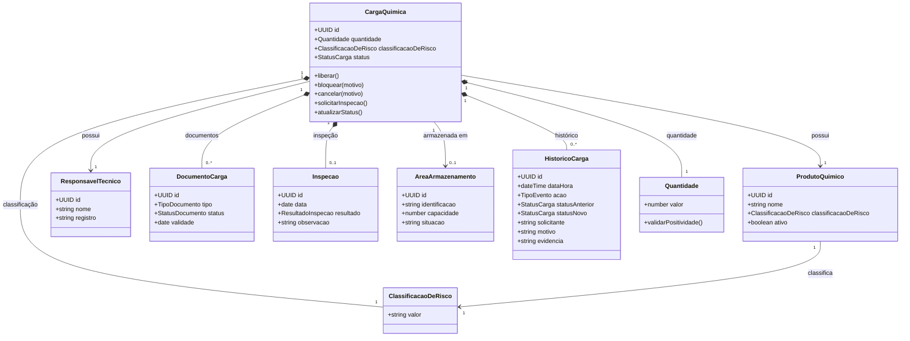

# Diagrama de Domínio

> Diagrama obrigatório da Fase 1: mostra o agregado principal, entidades, Value Objects e relacionamentos centrais.

```mermaid
classDiagram
class CargaQuimica {
  +UUID id
  +Quantidade quantidade
  +ClassificacaoDeRisco classificacaoDeRisco
  +StatusCarga status
  +liberar()
  +bloquear(motivo)
  +cancelar(motivo)
  +solicitarInspecao()
  +atualizarStatus()
}

class ProdutoQuimico {
  +UUID id
  +string nome
  +ClassificacaoDeRisco classificacaoDeRisco
  +boolean ativo
}

class ResponsavelTecnico {
  +UUID id
  +string nome
  +string registro
}

class DocumentoCarga {
  +UUID id
  +TipoDocumento tipo
  +StatusDocumento status
  +date validade
}

class Inspecao {
  +UUID id
  +date data
  +ResultadoInspecao resultado
  +string observacao
}

class AreaArmazenamento {
  +UUID id
  +string identificacao
  +number capacidade
  +string situacao
}

class HistoricoCarga {
  +UUID id
  +dateTime dataHora
  +TipoEvento acao
  +StatusCarga statusAnterior
  +StatusCarga statusNovo
  +string solicitante
  +string motivo
  +string evidencia
}

class Quantidade {
  +number valor
  +validarPositividade()
}

class ClassificacaoDeRisco {
  +string valor
}

CargaQuimica "1" --> "1" ProdutoQuimico : possui
CargaQuimica "1" --> "1" ResponsavelTecnico : possui
CargaQuimica "1" *-- "0..*" DocumentoCarga : documentos
CargaQuimica "1" *-- "0..1" Inspecao : inspeção
CargaQuimica "1" --> "0..1" AreaArmazenamento : armazenada em
CargaQuimica "1" *-- "1" Quantidade : quantidade
CargaQuimica "1" *-- "1" ClassificacaoDeRisco : classificação
CargaQuimica "1" *-- "0..*" HistoricoCarga : histórico
ProdutoQuimico "1" --> "1" ClassificacaoDeRisco : classifica
```
