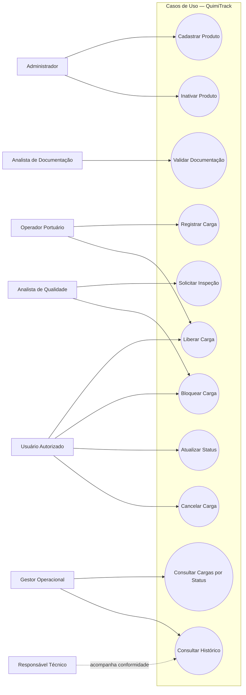

# Diagrama de Casos de Uso

> Diagrama complementar (os obrigatórios da Fase 1 são domínio e status). Ele visualiza os 11 casos de uso planejados e seus principais atores.

```mermaid
flowchart LR
    OP[Operador Portuário]
    ADM[Administrador]
    AD[Analista de Documentação]
    AQ[Analista de Qualidade]
    RT[Responsável Técnico]
    GO[Gestor Operacional]
    UA[Usuário Autorizado]

    subgraph UC[Casos de Uso — QuimiTrack]
      CP((Cadastrar Produto))
      IP((Inativar Produto))
      RC((Registrar Carga))
      VD((Validar Documentação))
      SI((Solicitar Inspeção))
      LC((Liberar Carga))
      BC((Bloquear Carga))
      US((Atualizar Status))
      CC((Cancelar Carga))
      CS((Consultar Cargas por Status))
      CH((Consultar Histórico))
    end

    ADM --> CP
    ADM --> IP
    OP --> RC
    AD --> VD
    AQ --> SI
    AQ --> BC
    OP --> LC
    UA --> LC
    UA --> BC
    UA --> US
    UA --> CC
    GO --> CS
    GO --> CH
    RT -. acompanha conformidade .-> CH
```
